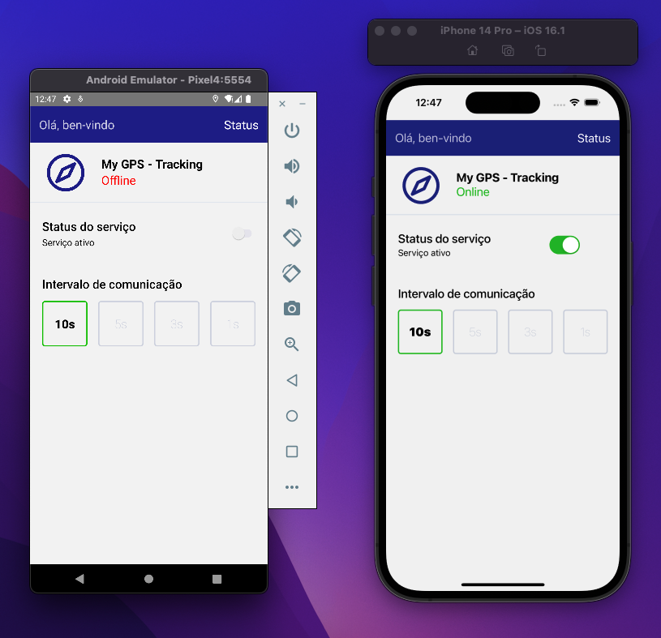

# contele-challenge

My GPS - Tracking: aplicação para monitoramento e geolocalização através dos sensores do smartphone!

## Pré-requisitos

- [Node.js > 12](https://nodejs.org) and npm (Recommended: Use [nvm](https://github.com/nvm-sh/nvm))
- [Watchman](https://facebook.github.io/watchman)
- [Xcode 12](https://developer.apple.com/xcode)
- [Cocoapods 1.10.1](https://cocoapods.org)
- [JDK > 11](https://www.oracle.com/java/technologies/javase-jdk11-downloads.html)
- [Android Studio and Android SDK](https://developer.android.com/studio)

## Dependências básicas

- [expo](https://docs.expo.dev/) O projeto foi criado através do expo.
- [axios](https://github.com/axios/axios) for networking.
- [react-navigation](https://reactnavigation.org/) para navegação entre as telas.
- [react-native-localization](https://github.com/stefalda/ReactNativeLocalization) para localização.
- [styled-components](https://styled-components.com/)Para a estilização.
- [typescript](https://docs.expo.dev/guides/typescript/)Instalação do Typescript no projeto.

## Estrutura de pastas

This template follows a very simple project structure:

- `src`: Pasta que contém todo o código da aplicação
  - `components`: Pasta que armazenas os componentes reutilizados na aplicação
  - `database`: Pasta que contém os arquivos e lócida do banco de dados.
    - `model`: Representação do modelo de dados usado para os pontos da api de localização.
    - `schema`: Schema do banco de dados para armazenar os pontos.
  - `hooks`: Pasta que armazena os hooks.
  - `screens`: Pasta que contém todas as telas.
    - `Home`: Tela Home.
    - `Status`: Tela Status.
  - `servoces`: Pasta que armazena os serviços e apis.
  
  
## Ambientes de configuração

### Usando scripts do console (packege.json "scripts")

DEV: `yarn ios` or `yarn android`

#### Print da tela inicial do app Rodando no Android e no IOS

Obrigado!
